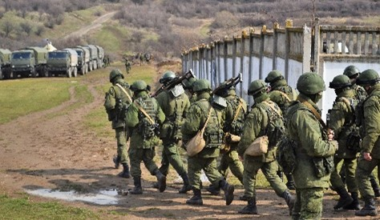
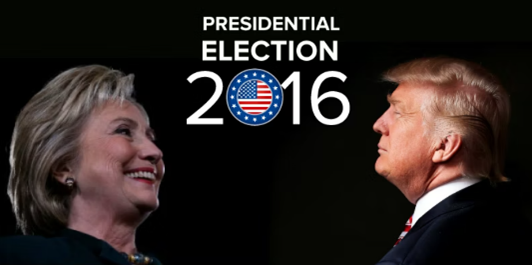
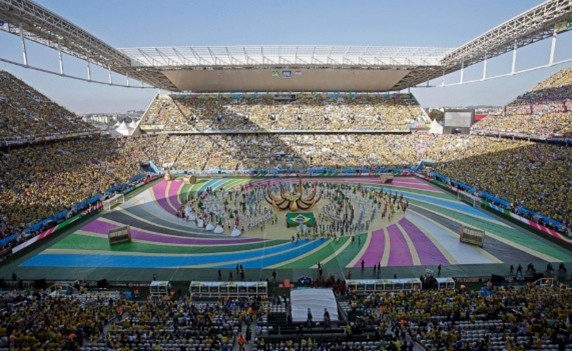
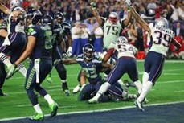
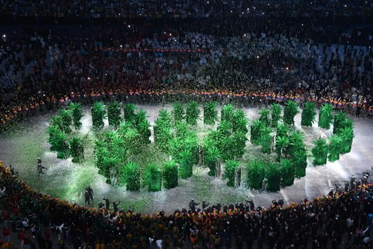

## Introduction

### When the world sneezes, Reddit catches a cold

When a major world event occurs — an election night, a surprise product launch, or
a breaking news story — millions of people turn to the internet to discuss, argue,
explain, and create memes. With its thousands of semi-independent communities,
Reddit becomes a living map of collective attention. Yet a fundamental question
remains: how does this attention move? Do communities that usually ignore one
another suddenly begin to interact? And once the moment passes, do those
connections fade away, or do they leave a lasting trace?

This project approaches Reddit not as a collection of isolated subreddits, but as a
dynamic network whose structure bends and responds to real-world events. By tracing
hyperlinks between subreddits over time, we observe how information flows, which
communities act as bridges, and whether event-driven interactions become part of
Reddit’s long-term structural backbone or disappear as quickly as they emerge.

Drawing on a large-scale hyperlink dataset enriched with sentiment measures,
subreddit embeddings, and external timelines of world events, the analysis focuses
on moments of collective attention and addresses a central question with broad
implications: when the world changes, does Reddit reorganize itself?

The sections that follow move from global patterns to local interactions — tracking
bursts of connectivity, identifying temporary brokers of information, and measuring
the persistence of relationships formed under the pressure of major events. What
emerges is a portrait of online communities that are highly reactive yet
structurally resilient, illustrating how digital spaces mirror — and at times
amplify — the rhythms of the real world.

## Adapting the data

When major events unfold in the real world, their impact is rarely uniform.
Elections polarize, disasters attract collective attention, and cultural moments
ripple unevenly across social groups. On Reddit, these dynamics leave observable
traces: bursts of activity, sudden cross-community interactions, and shifts in
sentiment that mirror offline societal responses. Yet such patterns are not
immediately visible in raw platform data — they must first be uncovered.

At first glance, Reddit appears as a dense web of interactions, where millions of
posts and hyperlinks form an overwhelming mass. Within this mass, however, not all
activity reflects genuine human behavior. Automated accounts contribute
disproportionately to content production, often amplifying specific narratives,
inflating connectivity, or sustaining discussions beyond the span of human
attention. Without addressing this distortion, network analysis risks conflating
artificial signals with authentic social reactions.

To isolate human-driven dynamics, abnormal posting behavior is identified using
unsupervised anomaly detection. We construct a high-dimensional feature space that
combines textual characteristics, posting dynamics, and sentiment statistics,
capturing how content is produced, expressed, and propagated over time. Due to
strong correlations and redundancy within this space, Principal Component Analysis
(PCA) is applied to project the data onto a lower-dimensional subspace that
preserves the dominant variance structure. Retaining components that explain 90%
of the total variance substantially reduces dimensionality while maintaining the
behavioral signatures required for discrimination.

<figure class="figure text-center">
  
  <figcaption class="figure-caption">
    Cumulative explained variance as a function of the number of principal
    components. The dashed line indicates the 90% variance threshold.
  </figcaption>
</figure>
 

On this reduced representation, an Isolation Forest model is used to detect
anomalous activity patterns. By recursively partitioning the feature space through
random splits, the model isolates observations that require fewer splits to
separate — a hallmark of rare or irregular behavior. Subreddits exhibiting
consistently short isolation paths are therefore flagged as disproportionately
bot-like, enabling highly automated sources of activity to be filtered from the
network. The resulting scores allow subreddits to be ranked by their estimated
proportion of bot-generated content. The accompanying figure highlights the
fifteen subreddits with the highest estimated bot-post rates.

<figure class="figure text-center">
  
  <figcaption class="figure-caption">
    <strong>Figure 4.</strong> Top fifteen subreddits ranked by the proportion of
    posts flagged as bot-like by the Isolation Forest model. High values indicate
    subreddits where automated activity is likely to dominate content production,
    motivating their exclusion from subsequent network analyses.
  </figcaption>
</figure>
 

Even after filtering automated behavior, Reddit’s structure remains far from
homogeneous. Aggregating all interactions into a single global network obscures
important heterogeneity and gives rise to statistical artifacts, including effects
consistent with Simpson’s paradox, where trends observed at the aggregate level
disappear or reverse when examined within subgroups. As in offline societies,
different communities respond to the same event in fundamentally different ways.

To capture this structure, hyperlink interactions are regrouped into clusters
representing broad thematic categories such as politics, sports, gaming, and world
news. At this level of abstraction, the network begins to resemble familiar social
systems. Certain communities act as hubs during moments of heightened attention,
mediating information flow across topics, while others remain more insulated and
locally focused. Connections form rapidly in response to events, intensify under
shared attention, and either decay or persist depending on the nature of the
trigger.

<figure class="figure text-center">
  
  <figcaption class="figure-caption">
    <strong>Figure 3.</strong> Cluster-level interaction network aggregated over
    the 2013–2017 period. Nodes represent thematic clusters of subreddits, while
    edges indicate hyperlink-based interactions between clusters. Edge thickness
    reflects interaction intensity. Several clusters act as structural hubs,
    mediating information flow across the network.
  </figcaption>
</figure>
 

The network visualization presented here depicts the fourteen most interconnected
clusters among the twenty identified across Reddit. Even at this aggregated scale,
clear structural patterns emerge: some thematic clusters function as hubs,
facilitating information flow across multiple communities, while others occupy
more peripheral positions with narrower, topic-focused interactions. The following
sections build on these observations by examining how these structures evolve in
response to external events and how different types of connections are
strengthened or weakened over time.

## Event-driven dynamics across the Reddit network
After filtering the dataset to remove bot-generated content and clustering posts to
better reflect real-world thematic interactions, the analysis turns to Reddit’s
response to major external events. These events are selected to span a wide range
of domains — political, social, cultural, and recreational — in order to examine
how different types of stimuli propagate through the Reddit network and activate
distinct communities.

The first group of events consists of major political developments with global
relevance. The annexation of Crimea by Russia on 18 March 2014 marked a turning
point in international relations and generated sustained political debate across
online platforms. Similarly, the Brexit referendum held on 23 June 2016, in which
the United Kingdom voted to leave the European Union, represented a historic
political decision with far-reaching consequences. Political engagement on Reddit
also peaked around the United States presidential election on 8 November 2016,
which resulted in the election of Donald Trump and triggered intense discussion
both domestically and internationally.

  
  
  

A second category focuses on large-scale sports events, which tend to attract
widespread attention beyond national boundaries. The opening of the FIFA World Cup
in Brazil on 12 June 2014 initiated one of the most watched sporting tournaments in
the world. This was followed by Super Bowl XLIX on 1 February 2015, a major cultural
and sporting event in the United States, and the opening ceremony of the Rio de
Janeiro Olympic Games on 5 August 2016, marking the start of a globally followed
international competition.

  
  
  

Entertainment-related events are also included due to their strong cultural
resonance and their ability to generate large volumes of online interaction. The
release of *Star Wars: The Force Awakens* on 18 December 2015 marked the return of a
highly influential film franchise and sparked extensive fan engagement. Attention
then shifted to the film industry with the 88th Academy Awards ceremony on 28
February 2016. In television, the premiere of the first episode of *Game of
Thrones* Season 6 on 24 April 2016 generated significant anticipation and discussion
across multiple Reddit communities.

In contrast to these planned events, a separate category captures sudden natural
and social crises that often lead to sharp and emotionally charged online
responses. The Ebola outbreak in West Africa in August 2014 escalated into a global
health emergency, while the terrorist attacks in Paris on 13 November 2015
prompted widespread shock and international solidarity. Natural disasters are
represented by the Illapel earthquake in Chile on 16 September 2015, a major
seismic event that caused significant damage and displacement.

To capture recurring patterns of social engagement, several widely observed
holidays are also considered. These include Independence Day on 4 July 2014, a
major national celebration in the United States; Christmas Day on 25 December
2015, both a religious and cultural holiday across many countries; and
Thanksgiving Day on 24 November 2016, a U.S. holiday closely associated with family
gatherings and shared traditions.

Finally, given the prominence of gaming-related communities on Reddit, major events
from the gaming industry are incorporated into the analysis. The release of
*Pokémon GO* on 6 July 2016 quickly evolved into a global phenomenon, blending
mobile gaming with augmented reality. This was preceded by the release of *Grand
Theft Auto V* on PlayStation 4 on 18 November 2014, which extended the reach of an
already highly successful title. The category concludes with the reveal of the
Nintendo Switch on 20 October 2016, an announcement that generated substantial
anticipation for Nintendo’s new hybrid gaming platform.

The impact of these events is first examined at an aggregate level by event
category in order to assess how highly salient real-world moments affect activity
across Reddit communities. The heat map displaying the number of posts per
community for each event type reveals clear and structured engagement patterns.
Political events emerge as the most influential overall, with particularly high
activity concentrated in the Politics, World, News, and Technology communities,
reflecting the broad societal scope of such developments. Sporting events show
strong engagement primarily within Sports, World, and Gaming, indicating that
large international competitions mobilize both news-oriented and recreational
audiences. Entertainment events generate substantial activity in Entertainment and
Gaming, with noticeable spillover into World-oriented discussions, highlighting
their cultural reach beyond dedicated fandoms. Social and natural disasters are
characterized by intense engagement within World and Social communities, pointing
to a collective focus on information sharing and social response during crises. In
contrast, holidays display a more diffuse and lower-intensity pattern across
communities, suggesting that while widely observed, they do not trigger sharp
increases in focused discussion.

Beyond posting volume, these events also influence the structure of the Reddit
network by altering the strength and persistence of connections between
communities. Political events, in particular, tend to reinforce existing ties
rather than create new ones. On average, the number of hyperlinks exchanged
between clusters nearly doubles during these periods and remains elevated after
the event window, indicating a lasting strengthening of interactions. This
increase in connectivity, however, is not accompanied by a corresponding rise in
positive sentiment; average sentiment during political events remains close to
neutral, suggesting that intensified debate does not necessarily translate into
constructive or positive exchanges.

Sporting events exhibit a similar initial strengthening of connections, most
notably among the Sports, World, and Gaming communities. Unlike political events,
these effects are largely temporary, with interaction levels returning to
baseline within approximately three months. Despite their short-lived nature,
sports events are associated with a broadly positive shift in sentiment, pointing
to a more unifying and emotionally positive form of engagement.

Entertainment events increase the volume of hyperlinks exchanged across
communities but do not consistently strengthen or weaken relationships in a
lasting way. Their effects appear balanced, with comparable numbers of
strengthened and weakened ties. A similar pattern is observed in sentiment
dynamics, where positive and negative shifts largely offset one another, implying
that entertainment-driven discussions are active but structurally neutral at the
network level.

Social and natural disasters, by contrast, tend to weaken inter-community
relationships more often than they strengthen them. In particular, connections
between Social and World communities — typically among the strongest — show
immediate weakening following such events. This pattern is accompanied by a
predominance of negative sentiment shifts, reflecting the emotionally distressing
nature of these crises.

Holidays show minimal structural impact on the Reddit network, with only a small
number of connections experiencing temporary strengthening during the event
window. Nevertheless, these periods are associated with predominantly positive
sentiment shifts, indicating that while holidays do not substantially reshape
interaction patterns, they tend to foster more positive exchanges.

Finally, gaming events stand out due to the central role of the Gaming community.
While interactions between non-gaming clusters remain largely unchanged,
connections involving the Gaming cluster experience pronounced strengthening,
alongside occasional sharp weakening. Overall, gaming events are associated with
an increase in positive sentiment across the network, underscoring their role as
highly engaging and emotionally positive triggers within Reddit.

## Event-Born Links: Short Flares or Lasting Imprints?

Major real-world events often trigger visible surges of activity on Reddit.
But do they actually reshape how communities connect to each other — or do they
merely amplify existing pathways?

To answer this question, we focus on **inter-cluster relationships**, tracking how
links between major thematic communities evolve *before*, *during*, and *after*
key global events.

---
We define an event-born edge as an inter-cluster hyperlink that appears for the first time during the event window and was absent in a matched pre-event baseline.

### Political shocks: strong spillovers, no structural creation

#### US Presidential Election (2016) — Political Shock

The 2016 US presidential election represents the most intense political shock in
our dataset. On Reddit, political discussion spills decisively into social and
relational communities.

Interactions between Politics / News and Social clusters increase sharply and
remain elevated well beyond the event window. Several existing inter-cluster ties
strengthen substantially, and sentiment shifts are pronounced, both positively
and negatively.

Yet despite this intensity, the underlying network structure remains unchanged.
No new inter-cluster relationships emerge, and no lasting structural bridges are
created. The same pathways are reused more intensively, but no new ones are added.

This pattern highlights a key distinction: high impact does not necessarily imply
structural novelty.

#### Charlie Hebdo Attacks (2015) — Political Crisis

The Charlie Hebdo attacks generate a different kind of political shock — one that
directly targets satire, free expression, and cultural identity.

Here, interactions between Politics / News and Humor / Reddit, as well as broader
cultural clusters, intensify strongly. A wide range of existing inter-cluster ties
strengthen simultaneously, reflecting collective emotional processing across
diverse communities.

Once again, however, no new inter-cluster relationships appear. The event amplifies
communication across many existing channels, but does not produce new long-term
structural connections.

Political crises, even when emotionally charged and culturally symbolic, appear to
activate the network without rewiring it.

---

### Collective entertainment: broad engagement, limited persistence

#### Super Bowl XLIX (2015) — Global Sports Event

The Super Bowl produces a short-lived but widespread social response. Sports
discussions spill into general, social, and entertainment-related clusters, with
many existing inter-cluster ties strengthening temporarily.

The persistence of these effects is moderate: interaction levels remain somewhat
elevated after the event, but gradually return toward baseline. No new inter-cluster
relationships are created, and weakened ties re-emerge shortly after.

This suggests that shared cultural spectacles mobilize attention broadly, but
rarely leave lasting structural traces.

#### Pokémon GO Launch (2016) — Cultural Phenomenon

The launch of *Pokémon GO* generates one of the most diffuse engagement patterns in
the dataset. Gaming communities connect more intensely with Social, General, and
Technology-related clusters, reflecting the game’s broad demographic reach.

Despite this unusually wide spillover, the pattern remains consistent with
previous cases: existing inter-cluster ties strengthen, sentiment shifts slightly,
but no new structural links emerge. The network absorbs the shock through
amplification rather than expansion.

---

### A consistent pattern: amplification without rewiring

Across political crises, cultural tragedies, and mass entertainment events, a
striking regularity emerges:

- No event creates new inter-cluster relationships at the structural level  
- Events consistently strengthen pre-existing bridges between communities  
- These effects are often partially lasting, but do not redefine the long-term
  backbone of the network  

In other words, Reddit reacts strongly — but conservatively. The network flexes
under pressure, channels attention through established pathways, and then
stabilizes without forming new durable connections.

---
### Cluster-level sentiment dynamics

While event-driven structural changes are extremely rare, sentiment reacts strongly
to major events — but in a highly non-uniform way across communities. Importantly,
the clusters experiencing the largest sentiment shifts are not the clusters where
events originate. Political, entertainment, and gaming communities primarily act as
sources of information and attention, rather than as sites of peak emotional
expression.

Instead, the strongest sentiment gains consistently appear in peripheral or
low-constraint clusters such as NSFW, Food, Finance, Humor / Reddit, and General.
These communities are loosely tied to specific topics and allow more expressive,
informal, or affective discourse. Across political crises, cultural shocks, and
entertainment releases, they function as emotional spillover zones, absorbing
reactions that remain weakly expressed in event-specific clusters.

This displacement of sentiment helps explain the network’s structural resilience.
Emotional intensity is redistributed away from tightly organized communities,
preventing local overload and reducing the incentive for new structural connections
to form. In this sense, sentiment diffuses broadly while structure remains
conservative: Reddit processes emotion through redirection rather than rewiring.
---
### What this tells us about event-driven connectivity

These findings suggest that Reddit’s community structure is highly resilient.
Even moments of shared global attention rarely create genuinely new links between
distant communities. Instead, events activate and intensify latent connections
that already exist.

This raises an important question for the remainder of the analysis:
**Are there any events that truly break this pattern?**

#### Game of Thrones, Season 6 (2016) — when fiction creates new bridges

The release of *Game of Thrones* Season 6 marks a rare departure from Reddit’s usual
structural stability.

Unlike political crises or mass sporting events, the premiere generates twelve
entirely new inter-cluster relationships between Entertainment / Movies / TV and
Politics / News communities. These links are absent in the two months preceding the
event and persist beyond the immediate post-event window.

This indicates genuine structural novelty: for once, a global cultural event does
not merely amplify existing pathways — it creates new ones.

The persistence of these connections is nonetheless nuanced. While the new links
remain present in the network, their interaction intensity declines rapidly after
the event. The overall persistence score reflects this dynamic: the structure
survives, but the activity does not.

This pattern contrasts sharply with political shocks such as the 2016 US
presidential election, where interaction surges dramatically but no new structural
connections emerge.

Taken together, these cases reveal a key asymmetry: fictional universes can
temporarily rewire the network, whereas political crises primarily reuse existing
bridges.

#### Not all cultural blockbusters rewire the network  
*Star Wars: The Force Awakens* (2015)

Despite its global reach and massive online engagement, the release of *Star Wars:
The Force Awakens* does not produce meaningful structural reconfiguration of the
Reddit network. Existing connections between entertainment communities and the
broader Reddit ecosystem are activated and sometimes intensified, but no new
inter-cluster relationships emerge that alter the long-term architecture.

This contrast highlights an important distinction: scale alone is insufficient to
rewire the network. While *Game of Thrones* Season 6 introduces genuinely new
connections across communities, *Star Wars* primarily mobilizes pre-existing
fandom structures.

Taken together, these cases suggest that narrative discontinuity and episodic
anticipation — rather than sheer popularity — are key drivers of structural
novelty in event-driven connectivity.

<!-- The file is under _includes/intra_cluster_analysis.md -->


## 5. What This Means for Echo Chambers (Conclusion Template)

In the final story, this conclusion will:

- summarise our main findings:
  - how often events create only short-lived bridges,  
  - which communities act as repeat “bridges”,  
  - which event-born ties seem to become structural.
- discuss what this means for **echo chambers** and information flow on Reddit.  
- reflect on the **limitations**:
  - one dataset, one time period  
  - hyperlink-based interactions only  
  - possible biases in event selection.

For now, we keep it as a template and will fill it once analyses are complete.

{: .text-justify}

---
## 6. Graphs from previous project
Below, we keep a few blocks from the previous project as layout examples.
> 🔎 *All the graphs you see below come from a previous ADA project about movies and diversity.  
> We temporarily keep them as **examples of how to embed figures** in the website.  
> They will be progressively replaced with our own Reddit plots as our analysis evolves.*

{: .text-justify}

     <!-- Example image kept from previous project -->

---
### Example: Dataset Description Block

    <!-- Left Side: Image -->
    

        
    

    
    <!-- Right Side: Text -->
    

        <b>Example dataset description from a previous project:</b>
        <ul>
            <li>Movie Name</li>
            <li>Release Year</li>
            <li>Actor Ethnicity</li>
            <li>Box Office Revenue</li>
        </ul>
        <i>We will later replace this with a similar bullet list describing our Reddit hyperlink dataset (columns, time range, etc.).</i>
    

    <!-- Left Side: Text -->
    

        <b>Example of enriched datasets:</b>
        <ul>
            <li>IMDb datasets and ratings.</li>
            <li>Awards and nominations.</li>
            <li>Mapping between different ID systems.</li>
        </ul>
        <i>In our project, this block will describe external data we add (event lists, Google Trends, etc.).</i>
    

    
    <!-- Right Side: Image -->
    

        
    

    

*Example figure from the previous project showing movie release dates.  
We will later replace this with a plot of our own (e.g., distribution of hyperlinks per day or per year).*

{: .text-justify}

---
Below, we keep some of last year’s plots purely as layout templates (group comparisons, side-by-side figures, etc.).

    

    

    

*Later, these layouts can host comparisons such as “event vs non-event”, “bridge communities vs others”, etc.*

---

    

    

        
    

    

        
    

    

    

        
    

    

        
    

    

    

    

        
    

    

        
    

---
### Example: Old Ethnicity Plots (Kept for Layout)

    

    

*Later, we might reuse this layout to show how subreddits are grouped into clusters (politics, movies, etc.).*

---

    

    

*Example histogram + time series layout that we will reuse with our own Reddit metrics.*

---

## 3. Example Highlight Box (To Reuse)

The “Movie Success Criteria” block below is a nice visual element that we plan to reuse.  
We will adapt the text later, for example to define:

- our **event windows** (pre / during / post)  
- or what counts as a **“new cross-link”** and as a **“persistent tie”**.

For now, we keep it as an example:



---

## References

<ul>
  <li>
    SNAP – Stanford Network Analysis Project.  
    <i>Reddit Hyperlinks Network (soc-RedditHyperlinks)</i>.  
    Available at:
    <a href="https://snap.stanford.edu/data/soc-RedditHyperlinks.html" target="_blank">
      https://snap.stanford.edu/data/soc-RedditHyperlinks.html
    </a>.
  </li>
</ul>

